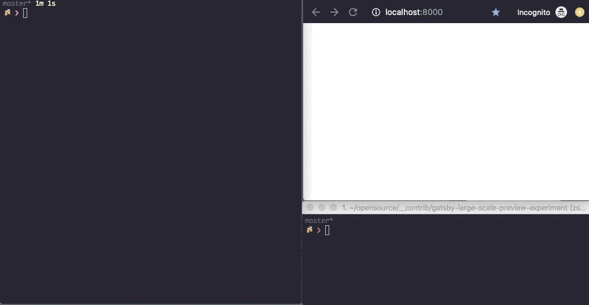

# Gatsby & Preview in a large scale environment.

This is an experiment. It's based on the preview/webhook parts of gatsby's e2e [test project](https://github.com/gatsbyjs/gatsby/tree/master/e2e-tests/development-runtime) (via @DSchau).

The core question to answer:
> How can we add/update/delete pages for specific nodes to achieve a good update performance in preview mode.

**The motivation:**<br>
Handle a large amount of pages being created from nodes (~ 50k-100k) during bootstrap and update/add a few during runtime (via `/__refresh`). We are aware that we have to write our own source plugins but we are searching for the best lifecycle combination to achieve our goal.

**Current experiment status:**<br>
Currently `createPages` always runs over ALL nodes whenever the webhook is triggered. It's not happening with `createPagesStatefully` as described in the docs but we are unsure how to handle added nodes to create our pages. Is `onCreateNode` the solution, the right place to use `createPage({})`? Are delete and updated nodes handled automatically by Gatsby and we are fine?

The following lifecycle hooks or methods seem to be part of the final solution:
+ sourceNodes
+ onCreateNode
+ createPages
+ createPagesStatefully
+ createPageDependency (helper)

---
Here details of the story:

## Goal
We want to check how Gatsby behaves with thousands of pages in develop mode + preview/webhook mode enabled (via ENABLE_GATSBY_REFRESH_ENDPOINT) as we have observed pretty slow updates and we don't know if this is a problem with the source plugins, our gatsby lifecycle hook implementations or a limitation inside Gatsby's develo server itself.

## Changes to the e2e base project
`plugins/gatsby-source-fake-data` is copied from the e2e project and and modified it slighly to easily create large initial amounts of nodes first and update a few later. Those are the changes:

+ Provide method `hugeInitialSync` in api.js to allow the creation of an initial large set of nodes (given by ENABLE_GATSBY_REFRESH_ENDPOINT). That way we simulate the first api call to retrieve all data.
+ The `api.sync` method is modified not to update all nodes. It's main task is to add a single node only yet — triggered with `yarn update:preview` which calls the __refresh endpoint with no payload.

We also removed most stuff from `gatsby-node.js` to focus on the page creation:
+ We added an activity status for the page creation. That way we can quickly see that Gatsby spends a long time just iterating over all nodes whenever that lifecycle hooks is called.

## The problem
Problem I want to show/tackle with this experiment.
The terminal windows shows the execution of the following commands:

```bash
# 01 start gatsby dev server (preview is active see .env file)
#    this will create 1000 nodes and derived pages
INITIAL_NODES_TO_CREATE=1000 yarn develop

# 02 do a full sync (add one node, touch all existing)
yarn webhook:full-sync

# 03 trigger an empty webhook call multiple times
#    this will cause the pages to be recreated at some point
yarn webhook:webhook-empty
yarn webhook:webhook-empty
yarn webhook:webhook-empty

# 04 create a new item by providing the data through the webhook
yarn webhook:new-item
```



The activity timer for "create-pages" clearly shows, that gatsby spends quite some time iterating over all nodes insdie the `createPages` lifecycle. We use the following query to retrieve the data.

```
const { data } = await graphql(`
  {
    allFakeData {
      nodes {
        fields {
          slug
        }
      }
    }
  }
`);
```
and we iterate over all nodes whenever createPages is called.

```
const totalPages = data.allFakeData.nodes.length;

data.allFakeData.nodes.forEach((node, index) => {
  activity.setStatus(
    `Creating ${index + 1} of ${totalPages} total pages`
  );
  //...
```

That's the moment where we output the progress activity `create-pages Ns — Creating XXX pages of YYY total pages`. You can see it counting upwards in the left panel in the gif whenever we trigger some changes.


Imagine a set of 100.000 pages — well or try it with 10.000 nodes

```
 INITIAL_NODES_TO_CREATE=10000 yarn develop
```

This will take roughly 10s for the `createPages` lifecycle hook part and 40s for the queries (260 queries/second) when being started the first time (bootstrap phase). That's expected and fine.

After that an update with `yarn webhook:new-item` which adds a node through the webhook payload it takes 15s for `createPages` to run, although nothing was touched. There was only a node added. The same happens with ` yarn webhook:empty`. We no nothing but Gatsby in Preview Mode will run all `sourceNodes` hooks through the api runner followed by the `createPages` lifecycle. That's somehow expected behaviour: createPages runs through all pages, because that's what we tell Gatsby to do in [gatsby-node.js](gatsby-node.js).

The question is:
> How can we add pages for only new nodes only after the initial bootstrap.

We already discovered [createPagesStatefully](https://www.gatsbyjs.org/docs/node-apis/#createPagesStatefully) which does somehow help in this scenario. The docs tell us this:

> createPagesStatefully..for plugins who want to manage creating and removing pages themselves in response to changes in data not managed by Gatsby. Plugins implementing createPages will get called regularly to recompute page information as Gatsby’s data changes but those implementing createPagesStatefully will not.

And indeed, it's called only once. So this would befine for the bootstrap but where to add new pages? Where to call `createPage({})`? The idiomatic idea: Run `createPage` inside our `sourceNodes` which seems to be a very wrong place in the lifecycle as Gatsby don't give us access to the boundActionCreators with the createPage method.

What about `onCreateNode` ? This could work:

```javascript
exports.onCreateNode = function onCreateNode({ actions, node, boundActionCreators }) {
  cosnt { createPage } = boundActionCreators;
  // createPage is available here
}
```

Is this the place to work in or does it make no sense? A quick test showed all initial pages being created but a webhook update through __refresh destroyed all pages. Probably because the nodes weren't touched?

Is this the way to go? `createPage` inside `onCreateNode`?
Do we need `createPageDependency` at any place or is this managed internally by Gatsby depending of the queries being run in the used page template?

